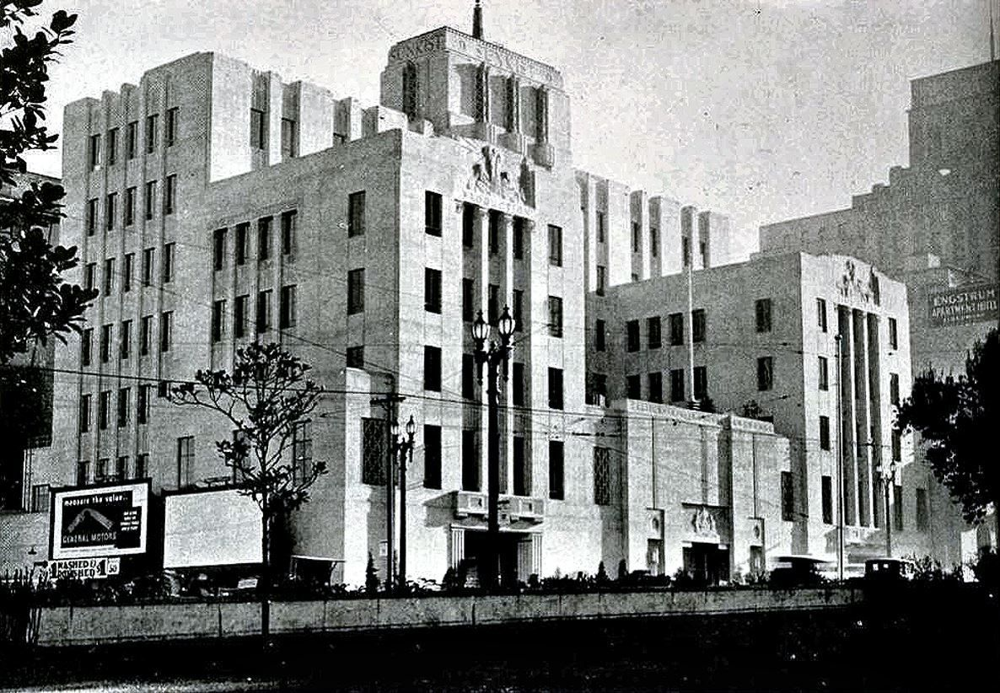

<!--
_class:
  - lead
  - invert
_paginate: false
-->

# Steal This Co-op Talk

History, Discussion, and Toolkit

<https://coopguide.org>

<!--
Thank you to Tech Workers Coalition for putting Circuit Breakers 2024 together, hope this is successful so we can see a 2025 edition

Thank you to all of you for being here, we've got so many important sessions happening this weekend, hopefully we can make a big impact
-->

---

# Solidarity

We meet today on the unceded territory of the Ramaytush Ohlone. We affirm their sovereign rights as First Peoples. The process of colonization is ongoing in the Bay Area.

Cooperatives seek to build an alternative economic and social structure that bring communities together in solidarity.

You may individually express solidarity by paying the Yakult (Village) Land Tax: <https://www.ramaytush.org/donate.html>

---

# Agenda

1. History
1. Definition
1. Patronage
1. Democracy
1. Workshop
1. Question Time

---
<!--
_backgroundImage: url("assets/mov-office.jpg")
_paginate: false
-->

---

# Ministry of Velocity

- Founded in 2013
- Software and training services
- Booked almost $13m in sales
- Mostly public sector / NPO
- Investigated co-op conversion in 2018
- Conversion in 2022/23

<!--
In 2013, I co-founded Ministry of Velocity with a friend, and we freelanced underneath that label as a partnership

My co-founder left in 2014, and I hired folks that I met through volunteering, client work, and in community

We mainly do custom software, design, and project management in the public and nonprofit sector, and we've booked about $13m in sales so far

In 2018, a couple dozen people worked at MoV, and I started investigating a co-op conversion with Project Equity

In 2022, we formally began the process of conversion, and by 2023 MoV was a cooperative
-->

---

<!--
_class: lead
_paginate: false
-->

# Familiarity

<!--
For the audience:
* How many of you are familiar with co-ops?
* How many of you have been in a co-op in the past?
* How many of you are in a worker-owned co-op today?
-->

---

<!--
_class:
  - invert
  - lead
_paginate: false
-->

# Cooperative History

<!--
Cooperatives are a concept more than a specific legal vehicle: a bunch of people pool their resources together, participate in trade, and the members receive a benefit

At least as of a couple years ago, the earliest record of a cooperative is the Fenwick Weavers' Society 18th century Scotland
-->

---

<!--
_class:
 - invert
 - lead
-->

# Class War

<!--
The cooperative mass movement, however, is born in class struggle during the era of Dickens' Oliver Twist.

In 1815, the British government's debt reaches a high of £1b at the end of the Napoleonic Wars.

The 1834 Poor Laws created workhouses where homeless Britons were housed, fed, and clothed. Labor was compulsory. Activists at the time called workhouses "Jails for the Poor"

One of the most popular theories among the rich was Malthusianism: a country’s population increases faster than its resources allow, which creates poverty

Malthus proposed a lower birth rate and a higher mortality rate by substituting philanthropy for the poor laws (welfare), which he felt “create the poor which they maintain”
-->

---

<!--
_backgroundImage: url(assets/New_Lanark_buildings_2009.jpg)
_paginate: false
_class:
  - invert
  - lead
_footer: mrpbps https://www.flickr.com/people/25413523@N08
-->

# Owenism

<!--
Picture of New Lanark, Scotland

Robert Owen bought the cotton mill at New Lanark by his father-in-law David Dale in 1799. Owen didn't like the material conditions workers faced, and developed his own brand of utopianism socialism, and his ideas grew into public talks about self-governing “villages of co-operation”

In good conscience, I can't continue without acknowledging that Owen's wealth and utopian vision were built on the cotton industry

This means this early utopian vision is directly connected to industrialized chattel slavery in the United States, the damage of which is born to this day by Black and indigenous people in this country
-->

---

<!--
_backgroundImage: url(assets/rochdale-museum.jpg)
_class:
  - invert
  - lead
_footer: diamond geezer https://www.flickr.com/photos/dgeezer/23746670698
-->

# Rochdale

<!--
Owen's talks inspired The Rochdale Pioneers.

They started a successful series of businesses, starting with this store in Rochdale, which is still a location you can visit today, although the cooperative has moved to nearby Manchester.

The Pioneers were a mix of Chartist and Owenite activists, workers, and well-paid artisans.

Their model was wildly successful and hundreds of small cooperative stores popped up around northern England within a few years
-->

---

<!--
_class:
  - invert
  - lead
_paginate: false
_footer:
  Arch Walker and Eisen https://danismm.tumblr.com/post/176046139629/sunkist-building-los-angeles-1936-arch-walker
-->

# Co-optation

<!--
This is a 1936 picture of the Sunkist building, headquarters of the California Fruit Growers Association, who established an alleged citrus monopoly in California

The USDA heavily promoted co-ops in the 1920s. With the passage of the Capper-Volstead Act, cooperatives became an easy way to avoid antitrust laws.
-->
---

<!--
_backgroundImage: url(assets/cooperation-jackson.jpg)
_class:
  - invert
  - lead
_footer: Cooperation Jackson https://cooperationjackson.org/announcementsblog/buildingclassconsciouscoops
-->

# Here and Now

<!--
Communities of color used co-ops to gain food access in the Jim Crow era and the natural foods movement adopted this strategy in the 1970s.

This picture, taken in 2016, shows some members of Cooperation Jackson, an example of a politically-active enterprise more in line with the original political and social movement of the Rochdale Pioneers
-->

---

# Definition

A cooperative is an autonomous __association__ of
persons united voluntarily to meet their common
economic, social and cultural needs and aspirations
through a jointly-owned and democratically-controlled
__enterprise__.

<!--
Historian, cooperative scholar, and Thompson Rivers University president Dr. Brett Fairbairn argues that cooperatives have a dual nature as an association and an enterprise.

While the enterprise aspect of cooperatives is similar to any business, the association aspect is a unique social formation that allows cooperatives to transcend profit-above-all logic and focus its energy on the community.
-->

---

<!--
_class:
  - invert
  - lead
_paginate: false
-->

# The Enterprise

<!--
A co-op is a business, and it's important to explore what that means.

For the audience:
How many of you have started or run a business before?
-->

---

<!--
_class: lead
-->

# Power

<!--
If you're coming into this room and don't know what to build, even if you're going to be offering hourly consulting, I recommend the Lean Startup book by Eric Ries

As your co-op starts up, it looks like everyone else: recruiting founders, landing your first sale, doing a little planning, and finding money

If you find money, you'll incorporate, and you'll need to make some serious decisions

This is the first point of difference compared to a traditional business: rather than creating a founder-led dictatorship where you make random guesses and maybe they work out, you're creating a power structure to make random guesses together
-->

---

<!--
_class: lead
_paginate: false
-->

# Jeff Parr

> Co-ops require knowing business: accounting, reviewing contracts... all the business stuff.
>
> Missing that knowledge can make these topics uncomfortable. Your co-op lives or dies based on your how you respond as a group.
>
> Co-op developers, vendors, and technical assistance from peers can help build that knowledge.

<!--
This is Jeff Parr, who's been at Ministry of Velocity since 2015. Jeff's an entrepreneur with a few decades of experience, and he's been a mentor to me at various points

Jeff's insight is important: the discomfort he's speaking to here is that power dynamic on your team, it exists today and it's the first hump to get over

Here's a really important insight that speaks to Principle 5, education: you can pay to get skills or an expert in the room, and this can save your co-op.
-->

---

<!-- _class: lead -->

# Patronage

<!--
One really important point here: we have a taboo around discussing money in our society. Violating that taboo is transgressive and uncomfortable.

Patronage comes up a lot in co-op literature. It basically means profit sharing, split up by how much you worked for the co-op.

In a just society, like the utopian village imagined by Robert Owen, patronage is the money that you own when your labor is sold on the market.

Today, when you work, all the money you make belongs to your company's owner, who must pay you, and may decide to give you benefits and bonuses.

In a cooperative, you are the owner, the money is yours. You have obligations to the co-op as an owner, so you'll reinvest some of it in the business. But you keep the rest.
-->

---

<!--
_footer: Marilyn Scholl https://www.cdsus.coop/
_paginate: false
-->

<!--
Let's start from the top by imagining a worker-owned hardware store.

The hardware store makes $10,100 in a week, and the members collectively worked 90 hours.

The members made a set of paid gardening videos, and that brings in $100 in a week, which are kept by the store for operations.

The $10,000 amount gets divided into a collective amount used to reinvest in the company.

The remainder is split up between members based on the number of hours they worked. Two members put in 40 hours each, so each person is allocated $4000, and the last person who worked 10 hours is allocated $1000.

The lease, utilities, inventory, and point of sale system all cost money, and the members agree to pay that out of their income. The rest is theirs to take home.
-->

---

<!--
_class: lead
-->

# Democratic Workplace

<!--
For the audience:
When was the last time you made a decision that affected your workplace?
-->

---

<!--
_class: lead
_paginate: false
-->

# Rae Bonfanti

> You might ask how much time to expect to spend on co-op duties.
>
> There's no getting around it. If you aren't handling business today, taking on co-op tasks will be a transition.
>
> We managed our time with committees, where a smaller set of members handles one concern, then report to the board.

<!--
This is Rae Bonfanti, my partner of 10 years, who was a founding member of the cooperative. Rae's an engineer with many years of nonprofit administration experience and an international development degree

Notice Rae's insight here: she's speaking to the efficiency of more structure. While it might seem counter-intuitive, the division of labor doesn't have to mean people lose power.

This speaks to the tension within Principle 2, Democratic Member Control. How will your democracy be shaped?
-->

---

<!--
_class: lead
_footer: Source: USFWC
-->

# Operations

__Governance__ sets strategic vision and policies

__Management__ handles day-to-day operations and implements policy

<!--
There are two types of activity when operating a business, and they happen at different cadences

While it's true that co-ops don't have bosses, they do need to have accountability structures.

Governance is the activity that a C-suite at a traditional company might do: strategic planning, creating policies, setting goals

Management is the activity that the middle management stack at a company performs: day-to-day operations, implementing policies, and in some cases coordination between groups

While every co-op is structured differently, the USFWC has a handout identifying four main types
-->

---

<!--
_footer: Source: USFWC https://prezi.com/view/fRM13gLGqeieZmKcmMR6/
-->

# Collectives

- Every member has equal governance power
- All members are on the board
- Collective or flat management structures

<!--
Collectives are where all members have equal governance power. This structure is usually found in small co-ops that aim for very little hierarchy.

Collective management, especially in non-hierarchical work environments, require extra active empowerment, education and leadership development activities.

Accountability is built-in but often needs attention (such as peer evaluations, running shared task lists, clear grievance procedures, etc.).
-->

---

<!--
_footer: Source: USFWC https://prezi.com/view/fRM13gLGqeieZmKcmMR6/
-->

# Sociocracy

- Governance is performed by circles or committees for specific topics
- Can include a governance circle
- Management is performed by circles
- Decisions are made via modified consensus

<!--
Co-ops that use Sociocracy can include a representative governance circle that functions much like a board.

Sociocracy uses a management structure that empowers circles (or committees) around specific work areas and uses general circles for dealing with overlap and inter-circle coordination.
-->

---

<!--
_footer: Source: USFWC https://prezi.com/view/fRM13gLGqeieZmKcmMR6/
-->

# Elected Board with Shared Governance

- Members elect a board of directors
- Members retain a form of membership-wide governance
- Regular (monthly/quarterly/annual) member meetings
- Managed by empowered committees
- Decisions via majority vote, with high quorums or supermajority votes

<!--
Co-ops that have an elected board empower this governing body to differing degrees. Some co-op boards maintain significant shared governance with members often including monthly, quarterly or very active annual member meetings.

Boards are often empowered to create policies, lead strategic planning, set an annual budget, coordinate between teams and oversee a general manager if the co-op has one.

Quorum (the minimum number of members needed to be participating in a meeting or decision) is often set higher and supermajorities (more than 50%) are required when voting on certain decisions.
-->

---

<!--
_footer: Source: USFWC https://prezi.com/view/fRM13gLGqeieZmKcmMR6/
-->

# Elected Board

- Members elect a board of directors
- Members ratify annual member meetings
- CEO and managers accountable to membership
- Majority rule (i.e. Robert's Rules of Order)

<!--
Some co-ops are organized much closer to a traditional company, and members retain very little governance decision-making power beyond electing the board and ratifying major decisions at annual or special meetings.

These co-ops usually have CEOs or managers that are hired, fired and overseen by the elected board, usually with a majority vote decision-making process.
-->
---

<!--
_class: lead
_footer: Source: McKenzie Jones https://www.linkedin.com/in/mckenzie-jones-2325488/
-->

# Breakout Sessions

Is this a board or management decision?

What checks and balances will ensure power is shared?

How will all members of the co-op have representation?

<!--
So now it's time to practice some democracy and act as a board. I've provided some decision matrix sheets for each group, along with three sample decisions for you to make. You don't have to choose those.

After you're done, we'll go around to each group and ask for a presentation.
-->

---

<!--
_class:
 - lead
 - invert
_footer: Source: McKenzie Jones https://www.linkedin.com/in/mckenzie-jones-2325488/
-->

# Report Back

What were your decisions?

Who makes those decisions?

How is power shared?

---

<!--
_class:
 - lead
-->

# Questions and Answers

---

# Community Connections

- US Federation of Worker Cooperatives
  <https://www.usworker.coop>

- Democracy at Work Institute
  <https://institute.coop>

- Agaric Show and Tell
  <https://agaric.coop/show-and-tell>

- Network of Bay Area Worker Cooperatives (NoBAWC)
  <https://nobawc.org>

---

<!--
_class:
 - lead
 - invert
_paginate: false
-->

# Thank you

## <doc@minifast.co>

### @ohrite

---

# Skill Building

- Democratic Management: A Practical Guide
  [Democracy at Work Institute](https://democracy.institute.coop/democratic-management-practical-guide-managers-and-others) · [PDF](assets/20230903-democratic-management-guide.pdf)

- Co-op Structure and Decision Making
  [US Federation of Worker Cooperatives](https://www.usworker.coop/blog/foundations-of-workplace-democracy-co-op-structure-and-decision-making/) · [PDF](assets/20241011-structure-and-decision-making.pdf)

- Introduction to Sociocracy
  [Sociocracy for All](https://www.sociocracyforall.org/content/) · [PDF](assets/20241011-sociocracy-summary.pdf)

---

# Workbook

- [This Slide Deck](https://coopguide.org/presentation.pdf)

- Membership and Trial Period
  [Excel](assets/20241011-membership-tool-template.xlsx) · [Google Docs](https://docs.google.com/spreadsheets/d/11hNVvu2uucvnax5U7DlzmMgX1Eo6A2HHlBAhtLPKneo/edit)

- Governance Matrix
  [Excel](assets/20241011-governance-matrix-template.xlsx) · [Google Docs](https://docs.google.com/spreadsheets/d/19RTFtleL3KdfT9NuKDtRLoPHDHI92hrJ679WisQHhWM/edit)

- Operating Agreement
  [Excel](assets/20241011-operating-agreement-template.xlsx) · [Google Docs](https://docs.google.com/spreadsheets/d/1I8LwJNXA-D2cBxdVCq-gW_HeA3aSXjOXlYF2LHanT5c/edit)
