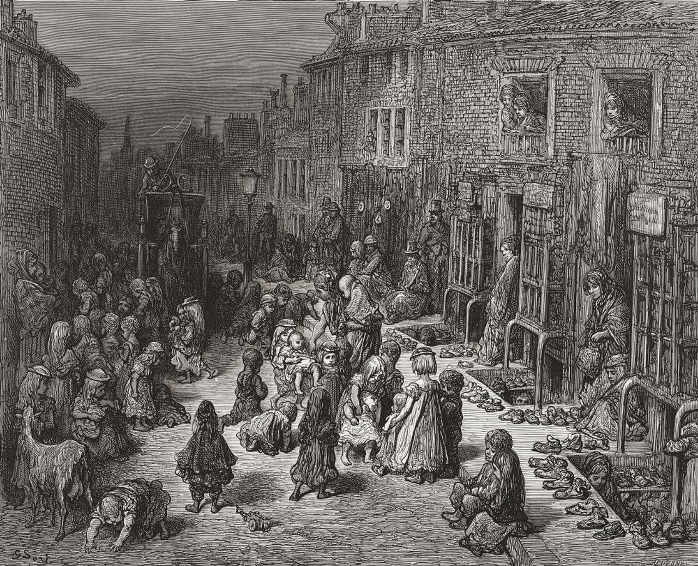
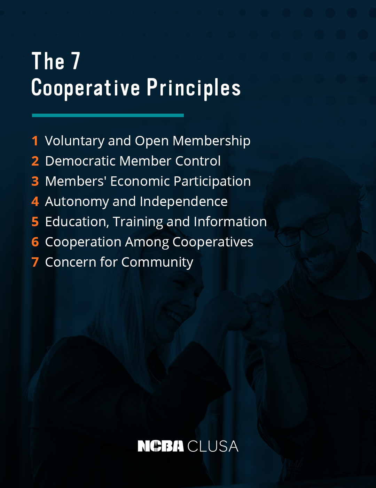
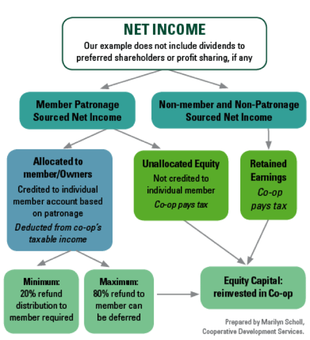

<!--
_class: lead
-->

# Let's Start a Co-op

Practical Guidance and Toolkit

<https://coopguide.org>

[Download PDF](https://coopguide.org/presentation.pdf)

---

# Solidarity

We meet today on the unceded territory of the Ramaytush Ohlone.
We affirm their sovereign rights as First Peoples. The process of
colonization is ongoing in the Bay Area.

In solidarity, cooperatives seek to build an alternative economic
and social structure that opposes colonialism.

You may express individual solidarity by paying the Land Tax:
https://www.ramaytush.org/donate.html

---

# Agenda

1. Definition
1. History
1. Patronage
1. Democracy
1. Workshop
1. Audience Questions

---
<!--
_backgroundImage: url("assets/mov-office.jpg")
_paginate: false
-->

---

# Ministry of Velocity

- Founded in 2013
- Software and training services
- Booked almost $13m in sales
- Mostly public sector / NPO
- Co-op conversion in 2022/23

---

<!--
_class: lead
_paginate: false
-->

# Familiarity

<!--
For the audience:
* How many of you are familiar with co-ops?
* How many of you have been in a co-op in the past?
* How many of you are in a worker-owned co-op today?
-->

---

<!--
_class:
  - invert
  - lead
_paginate: false
-->

# Cooperative History

<!--
Picture of the Rochdale co-op store
Early cooperatives existed in 18th century Scotland
-->

---

<!--
_class:
 - invert
 - lead
-->

# Class War

<!--
Like so much of history, cooperatives find their origin in class struggle,
starting in the era of Dickens.

In 1815, the British government's debt reaches a high of £1b
at the end of the Napoleonic Wars.

The 1834 Poor Laws created workhouses where homeless Britons
were housed, fed, and clothed. Labor was compulsory.

One of the most popular theories among the rich was Malthusianism:
a country’s population increases faster than its resources allow,
which creates poverty

Malthus proposed a lower birth rate and a higher mortality rate by
substituting philanthropy for the poor laws (welfare), which he felt
“create the poor which they maintain”
-->

---

<!--
_backgroundImage: url(assets/New_Lanark_buildings_2009.jpg)
_paginate: false
_class:
  - invert
  - lead
_footer: mrpbps https://www.flickr.com/people/25413523@N08
-->

# Owenism

<!--
Picture of New Lanark

Robert Owen was made manager of New Lanark by his father-in-law

Owen didn't like the material conditions workers faced, and adopted utopianism

Owen's ideas grew into self-governing “villages of co-operation”
-->

---

<!--
_backgroundImage: url(assets/rochdale-museum.jpg)
_class:
  - invert
  - lead
_footer: diamond geezer https://www.flickr.com/photos/dgeezer/23746670698
-->

# Rochdale
<!--
The Rochdale Pioneers, a mix of Chartist and Owenite activists, workers, and
well-paid artisans, start a successful series of businesses.
-->

---

<!--
_backgroundImage: url(assets/cooperation-jackson.jpg)
_class:
  - invert
  - lead
_footer: Cooperation Jackson https://cooperationjackson.org/announcementsblog/buildingclassconsciouscoops
-->

# Here and Now

<!--
The USDA heavily promoted co-ops in the 1920s,
communities  of color used co-ops to gain food
access in the Jim Crow era, and the natural
foods movement adopted it in the 1970s.

Today's cooperatives run the gamut between large enterprises like Mondragon,
small local businesses like a food co-op in your area, and social enterprises

Cooperation Jackson is an example of a politically-active enterprise
-->

---

# Definition

A cooperative is an _autonomous_ __association__ of persons united voluntarily to meet their common economic, social and cultural needs and aspirations through a _jointly-owned_ and _democratically-controlled_ __enterprise__.

<!--
The dual nature of cooperatives is on display here:

A cooperative is an association of people, which is a social formation

It's also an enterprise, which is an economic formation

A cooperative is a business enterprise, first and foremost

Its members are the investors, and must both buy in and participate
-->

---

<!--
_class:
  - invert
  - lead
_paginate: false
-->

# The Enterprise

<!--
For the audience:
How many of you receive a form of profit sharing at work?
-->

---

<!--
_class:
  - lead
_paginate: false
-->

# Jeff Parr

> Co-ops require knowing business: accounting, reviewing contracts...
> all the concerns that exist.
>
> Missing that knowledge can make these topics uncomfortable. The
> co-op depends on its response.
>
> Co-op developers, vendors, and technical assistance from peers can help build that knowledge.

---

# Co-op Economics

- Business economics
  - Sell a commodity, such as a good or service
  - Pay laborers a wage less than the sale price
  - `c + NL + SL = W`

---
<!--
_footer: Marilyn Scholl https://www.cdsus.coop/
_paginate: false
-->

<!--
# Allocating Patronage
- Surplus reinvested in capital and management
- Traditionally, owners keep the remainder ("profit")
- In co-ops, the surplus is allocated to members as __Patronage__
-->

---

<!--
_class:
  - invert
  - lead
_paginate: false
-->

# The Association

---

<!--
_footer: USFWC
-->

# Workplace Democracy

<!--
For the audience:
When was the last time you made a decision that affected your workplace?
-->

There are two types of activity when operating a business

- *Governance*: setting policies to steer the ship
- *Management*: implementing policies and fulfilling administrative tasks

---

# Experience report: Rae Bonfanti

---
<!--
_footer: USFWC
-->

# Collectives

- Every member has equal governance power
- All members are on the board
- Collective or flat management structures

---

<!--
_footer: USFWC
-->

# Sociocracy

- Governance is performed by circles or committees for specific topics
- Can include a governance circle
- Management is performed by circles
- Decisions are made via modified consensus

---

<!--
_footer: USFWC
-->

# Elected Board with Shared Governance

- Members elect a board of directors
- Members retain a form of membership-wide governance
- Regular (monthly/quarterly/annual) member meetings
- Managed by empowered committees
- Decisions via majority vote, with high quorums or supermajority votes

---

<!--
_footer: USFWC
-->

# Elected Board

- Members elect a board of directors

---

<!--
_footer: McKenzie Jones
-->

# Breakout Sessions

Points of Discussion

- Is this a board or management decision?
- What checks and balances can you create to ensure power is shared among
  governing and managing bodies?
- How will you ensure all members of the co-op have representation?

---

# Report Back

---

# Questions and Answers

---

# Thank you

## Doc Ritezel

### <doc@minifast.co>

#### @ohrite
