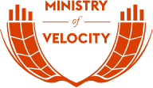

<!-- _class: lead -->

# Start a Co-op

History, Experience, Practice

<https://coopguide.com>

---

# Solidarity

<!--
Land acknowledgement
-->

---

# Agenda

1. Definition
1. History
1. Patronage
1. Democracy
1. Workshop
1. Audience Questions

---

# Ministry of Velocity

- Founded in 2013
- Software and training services
- Booked almost $13m in sales
- Mostly public sector / NPO
- Converted in 2022/23

---

# Cooperatives

<!--
For the audience:
* How many of you are familiar with co-ops?
* How many of you have been in a co-op in the past?
* How many of you are in a worker-owned co-op today?
-->

---

# Cooperative History: Part 1

## Austerity Strikes Back

When the UK went bankrupt during the
Napoleonic Wars, the existing welfare
system fell prey to austerity.

<!--
One of the most popular theories among the rich was Malthusianism:
a country’s population increases faster than its resources allow,
which creates poverty

Malthus proposed a lower birth rate and a higher mortality rate by
substituting philanthropy for the poor laws (welfare), which he felt
“create the poor which they maintain”
-->

---

# Cooperative History: Part 2

## Utopianism

Robert Owen, a Welsh cotton industrialist,
proposed self-governing workhouses
(“villages of co-operation”) which provided
wages and a safety net.

---

# Cooperative History: Part 3

## Socialism

The Rochdale Pioneers, a mix of Chartist and
Owenite activists, workers, and relatively
well-paid artisans, start a successful series
of businesses.

---

# Cooperative History: Part 4

## The Modern Era

The USDA heavily promoted co-ops in the 1920s,
communities  of color used co-ops to gain food
access in the Jim Crow era, and the natural
foods movement adopted it in the 1970s.

---

# Principles

1. Voluntary and Open Membership
2. Democratic Member Control
3. Member Economic Participation
4. Autonomy and Independence
5. Education, Training, and Eduction
6. Co-operation among Co-operatives
7. Concern for Community

---

# Economic Participation

<!--
For the audience:
How many of you receive a form of profit sharing at work?
-->

A cooperative is a business enterprise, first and foremost

Its members are the investors, and must both buy in and participate

---

# Experience Report: Jeff Parr

> You’ll be asking members who may not know about business
> for their input.
>
> This requires fluency in many disciplines: accounting, reviewing
> contracts, ... all the concerns that exist in business.
>
> Developers, vendors, and technical assistance from USWFC
> can help build that familiarity.
>
> Lacking business fluency can make these topics uncomfortable.
> The group's success lies in how it deals with that.

---

# Co-op Economics

- Business economics
  - Sell a commodity, such as a good or service
  - Pay laborers a wage less than the sale price
  - `c + NL + SL = W`
- Surplus reinvested in capital and management
- Traditionally, owners keep the remainder ("profit")
- In co-ops, the surplus is allocated to members as __Patronage__

---

# Patronage

---

# Workplace Democracy

<!--
For the audience:
When was the last time you made a decision that affected your workplace?
-->

There are two types of activity when operating a business

- *Governance*: setting policies to steer the ship
- *Management*: implementing policies and fulfilling administrative tasks

Source: USFWC

---

# Experience report: Rae B

---

# Democratic Structures (1)

## Collectives

- Every member has equal governance power
- All members are on the board
- Collective or flat management structures

Source: USFWC

---

# Democratic Structures (2)

## Sociocracy

- Governance is performed by circles or committees for specific topics
- Can include a governance circle
- Management is performed by circles
- Decisions are made via modified consensus

Source: USFWC

---

# Democratic Structures (3)

## Elected Board with Shared Governance

- Members elect a board of directors
- Members retain a form of membership-wide governance
- Regular (monthly/quarterly/annual) member meetings
- Managed by empowered committees
- Decisions via majority vote, with high quorums or supermajority votes

---

# Democratic Structures (4)

## Elected Board

- Members elect a board of directors

Source: USFWC

---

# Breakout Sessions

Points of Discussion

- Is this a board or management decision?
- What checks and balances can you create to ensure power is shared among
  governing and managing bodies?
- How will you ensure all members of the co-op have representation?

Source: McKenzie Jones

---

# Report Back

---

# Questions and Answers

---

# Thank you

## Doc Ritezel

### <doc@minifast.co>

#### @ohrite
