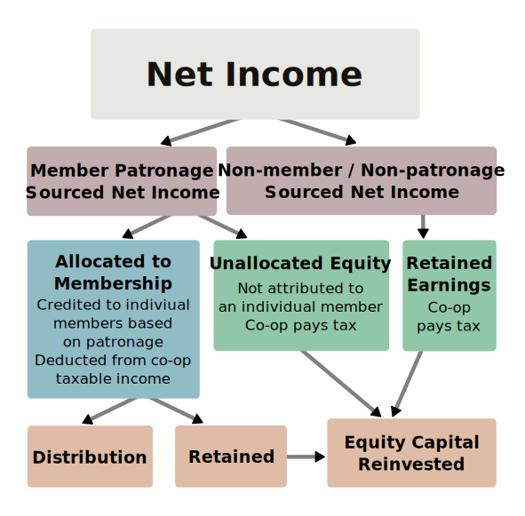

<!--
_class:
  - lead
  - invert
_paginate: false
-->

# Steal This Co-op Talk

History, Discussion, and Toolkit

<https://coopguide.org>

<!--
Thank you to Tech Workers Coalition for putting Circuit Breakers 2024 together, hope this is successful so we can see a 2025 edition

Thank you to all of you for being here, we've got so many important sessions happening this weekend, hopefully we can make a big impact
-->

---

# Solidarity

We meet today on the unceded territory of the Ramaytush Ohlone. We affirm their sovereign rights as First Peoples. The process of colonization is ongoing in the Bay Area.

Cooperatives seek to build an alternative economic and social structure that bring communities together in solidarity.

You may individually express solidarity by paying the Yakult (Village) Land Tax: <https://www.ramaytush.org/donate.html>

---

# Agenda

1. History
1. Definition
1. Patronage
1. Democracy
1. Workshop
1. Question Time

---
<!--
_backgroundImage: url("assets/mov-office.jpg")
_paginate: false
-->

---

# Ministry of Velocity

- Founded in 2013
- Software and training services
- Booked almost $13m in sales
- Mostly public sector / NPO
- Investigated co-op conversion in 2018
- Conversion in 2022/23

<!--
In 2013, I co-founded Ministry of Velocity with a friend, and we freelanced underneath that label as a partnership

My co-founder left in 2014, and I hired folks that I met through volunteering, client work, and in community

We mainly do custom software, design, and project management in the public and nonprofit sector, and we've booked about $13m in sales so far

In 2018, a couple dozen people worked at MoV, and I started investigating a co-op conversion with Project Equity

In 2022, we formally began the process of conversion, and by 2023 MoV was a cooperative
-->

---

<!--
_class: lead
_paginate: false
-->

# Familiarity

<!--
For the audience:
* How many of you are familiar with co-ops?
* How many of you have been in a co-op in the past?
* How many of you are in a worker-owned co-op today?
-->

---

<!--
_class:
  - invert
  - lead
_paginate: false
-->

# Cooperative History

<!--
Cooperatives are a concept more than a specific legal vehicle: a bunch of people pool their resources together, participate in trade, and the members receive a benefit

At least as of a couple years ago, the earliest record of a cooperative is the Fenwick Weavers' Society 18th century Scotland
-->

---

<!--
_class:
 - invert
 - lead
-->

# Class War

<!--
The cooperative mass movement, however, is born in class struggle during the era of Dickens' Oliver Twist.

In 1815, the British government's debt reaches a high of £1b at the end of the Napoleonic Wars.

The 1834 Poor Laws created workhouses where homeless Britons were housed, fed, and clothed. Labor was compulsory. Activists at the time called workhouses "Jails for the Poor"

One of the most popular theories among the rich was Malthusianism: a country’s population increases faster than its resources allow, which creates poverty

Malthus proposed a lower birth rate and a higher mortality rate by substituting philanthropy for the poor laws (welfare), which he felt “create the poor which they maintain”
-->

---

<!--
_backgroundImage: url(assets/New_Lanark_buildings_2009.jpg)
_paginate: false
_class:
  - invert
  - lead
_footer: mrpbps https://www.flickr.com/people/25413523@N08
-->

# Owenism

<!--
Picture of New Lanark, Scotland

Robert Owen was made manager of New Lanark by his father-in-law

Owen didn't like the material conditions workers faced, and adopted utopianism

Owen's ideas grew into self-governing “villages of co-operation”
-->

---

<!--
_backgroundImage: url(assets/rochdale-museum.jpg)
_class:
  - invert
  - lead
_footer: diamond geezer https://www.flickr.com/photos/dgeezer/23746670698
-->

# Rochdale
<!--
The Rochdale Pioneers, a mix of Chartist and Owenite activists, workers, and
well-paid artisans, start a successful series of businesses.
-->

---

<!--
_backgroundImage: url(assets/cooperation-jackson.jpg)
_class:
  - invert
  - lead
_footer: Cooperation Jackson https://cooperationjackson.org/announcementsblog/buildingclassconsciouscoops
-->

# Here and Now

<!--
The USDA heavily promoted co-ops in the 1920s,
communities  of color used co-ops to gain food
access in the Jim Crow era, and the natural
foods movement adopted it in the 1970s.

Today's cooperatives run the gamut between large enterprises like Mondragon,
small local businesses like a food co-op in your area, and social enterprises

Cooperation Jackson is an example of a politically-active enterprise
-->

---

# Definition

A cooperative is an _autonomous_ __association__ of
persons united voluntarily to meet their common
economic, social and cultural needs and aspirations
through a _jointly-owned_ and _democratically-controlled_
__enterprise__.

<!--
The dual nature of cooperatives is on display here:

A cooperative is an association of people, which is a social formation

It's also an enterprise, which is an economic formation

A cooperative is a business enterprise, first and foremost

Its members are the investors, and must both buy in and participate
-->

---

<!--
_class:
  - invert
  - lead
_paginate: false
-->

# The Enterprise

<!--
For the audience:
How many of you receive a form of profit sharing at work?
-->

---

<!--
_class:
  - lead
_paginate: false
-->

# Jeff Parr

> Co-ops require knowing business: accounting, reviewing contracts... all the business stuff.
>
> Missing that knowledge can make these topics uncomfortable. Your co-op lives or dies based on your how you respond as a group.
>
> Co-op developers, vendors, and technical assistance from peers can help build that knowledge.

<!--
This is Jeff Parr who's been at Ministry of Velocity since 2015. Jeff's an entrepreneur with a few decades of experience as a founder

Jeff's insight is important: the discomfort he's speaking to here is a power dynamic on your team, it exists today and it's the first hump for your group

Here's a really important insight that speaks to Principle 5, education: you can pay to get skills or an expert in the room, and this can save your group.
-->

---

# Co-op Economics

- Business economics
  - Sell a commodity, such as a good or service
  - Pay laborers a wage less than the sale price
- Operations overhead
- Traditional company vs. co-op
  - Owners benefit in both cases

<!--
  `c + NL + SL = W`
-->

---
<!--
_footer: Marilyn Scholl https://www.cdsus.coop/
_paginate: false
-->

<!--
# Allocating Patronage
- Surplus reinvested in capital and management
- Traditionally, owners keep the remainder ("profit")
- In co-ops, the surplus is allocated to members as __Patronage__
-->

---

<!--
_footer: USFWC
-->

# Workplace Democracy

<!--
For the audience:
When was the last time you made a decision that affected your workplace?
-->

There are two types of activity when operating a business

- _Governance_: setting policies to steer the ship
- _Management_: implementing policies and fulfilling administrative tasks

---
<!--
_class: lead
_paginate: false
-->
# Rae Bonfanti

> You might ask how much time to expect to spend on co-op duties.
>
> There's no getting around it. If you aren't
> handling business today, taking on co-op
> tasks will be a transition.
>
> We managed our time with committees,
> where a smaller set of members handles
> one concern, then report to the board.

<!-- it's a reasonable question for prospective co-op members
to ask how much time they're expected to spend

especially if you're coming from design or engineering,
you'll spend more time on organizational matters

there will be an adjustment period

you'll participate in governance and management that will
impact your work

there's no getting around this, and the smaller the co-op
the more work there is to do

a committee is a group of members who specialize in one
area of management concerns, like finance or HR

I experienced this via sociocracy at MoV, this allows a
small set of people to implement policy

committee members have a duty to educate the larger body
so they can make informed governance decisions

members don't need to know everything or have a lot
of knowledge in order to make decision

committees at MoV were quite small, with an expert as
chair and a learner in an administrative role

this helps develop skills and capacity inside the co-op

a third party can fulfill that expert capacity -->

---
<!--
_footer: USFWC https://prezi.com/view/fRM13gLGqeieZmKcmMR6/
-->

# Collectives

- Every member has equal governance power
- All members are on the board
- Collective or flat management structures

---

<!--
_footer: USFWC https://prezi.com/view/fRM13gLGqeieZmKcmMR6/
-->

# Sociocracy

- Governance is performed by circles or committees for specific topics
- Can include a governance circle
- Management is performed by circles
- Decisions are made via modified consensus

---

<!--
_footer: USFWC https://prezi.com/view/fRM13gLGqeieZmKcmMR6/
-->

# Elected Board with Shared Governance

- Members elect a board of directors
- Members retain a form of membership-wide governance
- Regular (monthly/quarterly/annual) member meetings
- Managed by empowered committees
- Decisions via majority vote, with high quorums or supermajority votes

---

<!--
_footer: USFWC https://prezi.com/view/fRM13gLGqeieZmKcmMR6/
-->

# Elected Board

- Members elect a board of directors
- Members have little governance power after election
- Members ratify annual member meetings
- CEO and managers accountable to membership
- Majority rule (i.e. Robert's Rules of Order)

---

<!--
_footer: McKenzie Jones https://www.linkedin.com/in/mckenzie-jones-2325488/
-->

# Breakout Sessions

- Is this a board or management decision?
- What checks and balances will ensure power is shared?
- How will all members of the co-op have representation?

---

<!--
_class:
 - lead
 - invert
-->

# Report Back

What were your decisions?

Who makes those decisions?

How is power shared?

---

<!--
_class:
 - lead
-->

# Questions and Answers

---

# Community Connections

- US Federation of Worker Cooperatives
  <https://www.usworker.coop>

- Democracy at Work Institute
  <https://institute.coop>

- Agaric Show and Tell
  <https://agaric.coop/show-and-tell>

- Network of Bay Area Worker Cooperatives (NoBAWC)
  <https://nobawc.org>

---

<!--
_class:
 - lead
 - invert
_paginate: false
-->

# Thank you

## <doc@minifast.co>

### @ohrite

---

# Skill Building

- Democratic Management: A Practical Guide
  [Democracy at Work Institute](https://democracy.institute.coop/democratic-management-practical-guide-managers-and-others) · [PDF](assets/20230903-democratic-management-guide.pdf)

- Co-op Structure and Decision Making
  [US Federation of Worker Cooperatives](https://www.usworker.coop/blog/foundations-of-workplace-democracy-co-op-structure-and-decision-making/) · [PDF](assets/20241011-structure-and-decision-making.pdf)

- Introduction to Sociocracy
  [Sociocracy for All](https://www.sociocracyforall.org/content/) · [PDF](assets/20241011-sociocracy-summary.pdf)

---

# Workbook

- [This Slide Deck](https://coopguide.org/presentation.pdf)

- Membership and Trial Period
  [Excel](assets/20241011-membership-tool-template.xlsx) · [Google Docs](https://docs.google.com/spreadsheets/d/11hNVvu2uucvnax5U7DlzmMgX1Eo6A2HHlBAhtLPKneo/edit)

- Governance Matrix
  [Excel](assets/20241011-governance-matrix-template.xlsx) · [Google Docs](https://docs.google.com/spreadsheets/d/19RTFtleL3KdfT9NuKDtRLoPHDHI92hrJ679WisQHhWM/edit)

- Operating Agreement
  [Excel](assets/20241011-operating-agreement-template.xlsx) · [Google Docs](https://docs.google.com/spreadsheets/d/1I8LwJNXA-D2cBxdVCq-gW_HeA3aSXjOXlYF2LHanT5c/edit)
